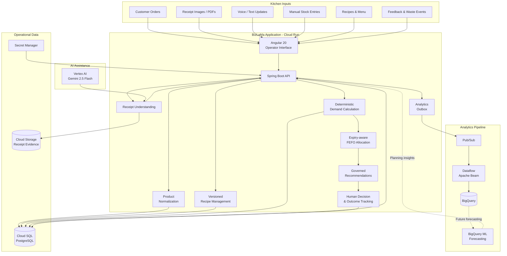

# BizLaMa Hackathon Submission

## 1. Idea title

**BizLaMa - AI-Assisted Kitchen Operations and Food-Waste Intelligence**

## 2. Idea one-liner

BizLaMa connects orders, recipes, inventory, receipts, and expiry data so food businesses can buy intelligently, use stock on time, prevent shortages, and reduce avoidable food waste.

## 3. Detailed idea description

BizLaMa is a cloud-based operations platform for small restaurants, cafes, bakeries, cloud kitchens, and growing food businesses.

These businesses often manage orders, recipes, purchases, inventory, receipts, and staff updates through separate apps, spreadsheets, paper bills, or conversations. Even when the information exists, it is rarely connected well enough to answer everyday questions:

- How much of each ingredient do upcoming orders require?
- Is the available stock sufficient, unexpired, and safe to use?
- Which stock should be consumed first?
- What may expire before it can be used?
- Should the business buy more, prepare something from existing stock, or avoid an unnecessary purchase?
- Did a recommendation actually prevent waste or a stockout?

BizLaMa connects these activities in one operational loop. Each order is linked to the exact recipe version used for the dish. Recipe quantities become ingredient demand, which is compared with usable inventory lot by lot. Stock is allocated using FEFO, or first expiry first out. The system can then identify shortages and expiry-risk surplus and recommend practical actions such as:

- Purchase 500 grams of paneer for tomorrow's confirmed orders.
- Use an existing paneer lot before buying more.
- Prepare a suitable dish using tomatoes that will expire soon.
- Avoid an excess purchase because current stock already covers demand.

Information can enter through forms, orders, voice or text updates, and receipt images or PDFs. Product normalization maps supplier descriptions such as **"Amul Fresh Paneer," "Heritage High Protein Paneer,"** and **"Cottage Cheese"** to the operational ingredient **"paneer,"** while retaining the original name, brand, source, and confidence for traceability.

AI helps where interpretation is useful, including receipt extraction and plain-language explanations. Inventory arithmetic, unit conversion, FEFO allocation, money calculations, recipe activation, and stock changes remain deterministic, repeatable, and governed.

The long-term operating cycle is:

**Capture → Normalize → Calculate → Recommend → Decide → Apply → Measure**

## 4. Problem it solves

Small food businesses rarely have one connected view of demand, stock, expiry, and production. An order system may know that ten paneer sandwiches were sold but not calculate the paneer, bread, butter, and vegetables needed to make them. Inventory may contain branded names, inconsistent units, and uncertain expiry dates. Receipts often remain paper bills or images instead of becoming traceable stock records.

This leads to:

- Purchases made without checking usable stock.
- Expiring ingredients discovered too late.
- Newer stock consumed before older stock.
- Shortages noticed only when preparation begins.
- Recipe changes without reliable version history.
- Different product names across suppliers, receipts, and kitchen terminology.
- No clear way to measure whether a recommendation prevented waste.
- Heavy dependence on manual checks and individual staff memory.

BizLaMa connects these records and combines dependable kitchen calculations with carefully governed AI assistance.

## 5. Negative impact if the problem remains unsolved

Disconnected operations create higher food waste and disposal costs, duplicate purchases, stockouts, expensive emergency buying, delayed or cancelled orders, lower margins, inconsistent dishes, and poor traceability between purchasing, consumption, and waste. Unclear expiry information can also increase food-safety risk.

Owners spend more time checking stock manually and remain dependent on staff memory. They cannot easily tell which decisions improved performance. The environmental cost extends beyond the discarded food because the water, energy, transport, refrigeration, and packaging used to produce and move it are also wasted.

## 6. How BizLaMa solves the problem

### Step 1: Capture operational information

BizLaMa accepts customer orders, manual purchases and stock updates, receipt images or PDFs, voice or text updates, recipes, menu changes, production, waste, and customer feedback.

### Step 2: Normalize ingredients

Supplier and branded names are mapped to canonical ingredients:

**Amul Fresh Paneer / Heritage High Protein Paneer / Cottage Cheese → Paneer**

The original description, brand, matching source, and confidence remain available.

### Step 3: Preserve recipe truth

Each dish can have multiple ingredients, quantities, units, ordered preparation steps, a recipe yield, version history, change reasons, approval details, and one explicitly active version. Orders retain the recipe version used when they were accepted, so later edits do not rewrite historical demand.

### Step 4: Calculate ingredient demand

The deterministic engine expands each order using:

**Order quantity × Recipe ingredient quantity ÷ Recipe yield**

Demand from multiple orders is combined while retaining evidence about the contributing orders and recipe versions.

### Step 5: Calculate usable inventory

Stock is evaluated by ingredient, kitchen, location, canonical unit, remaining quantity, expiry date, quarantine state, and existing reservations. Expired or quarantined stock is excluded, and eligible lots are used in FEFO order.

### Step 6: Identify shortages and expiry risk

BizLaMa calculates gross demand, usable supply, safety stock, shortage quantity, and stock likely to remain unused before expiry.

### Step 7: Recommend an action

The system can recommend:

- **PURCHASE**
- **PREPARE**
- **UTILISE_EXPIRING_STOCK**
- **REDUCE_OR_AVOID_PURCHASE**

Each recommendation retains its calculation, supporting orders, recipe versions, stock lots, proposed quantity, and decision history.

### Step 8: Keep people in control

Operators can view the calculation, approve or edit the quantity, dismiss the recommendation, report an incorrect stock count, apply an approved action, and record the result.

High-impact actions require confirmation, and recipe changes require explicit authorized approval.

### Step 9: Measure the result

The intended measurement loop tracks waste avoided, stockouts prevented, excess and emergency purchases, recommendation acceptance, owner overrides, prepared and sold quantities, and future forecast accuracy.

This moves BizLaMa from record keeping toward measurable decision support.

## 7. Architectural diagram

**Diagram note:** Solid paths show the core application and implemented foundation. Dashed paths show prepared or planned analytics capabilities that still require complete live-cloud verification.

## 8. Data sources

### Operational data

BizLaMa learns from normal business activity: orders, menu items, recipe versions, ingredients, preparation steps, suppliers, purchases, stock lots, movements, receipts, reviewed receipt lines, production, consumption, waste, recommendation decisions, outcomes, and customer feedback.

Cloud SQL remains the intended source of truth.

### Public shelf-life references

The USDA FoodKeeper dataset provides reference information for food storage and shelf life. Because it is not designed for every Indian product, climate, or storage practice, raw data is preserved separately and only reviewed, relevant rules enter operational use.

A public estimate never overrides a printed expiry date. Uncertain cases require review, and Indian ingredients and practices can be added through a curated dataset.

### Product and recipe catalogue

The prototype includes seeded Indian household ingredients, spices, dairy products, vegetables, global pantry items, branded aliases, menu items, and recipes. This demonstrates the workflow; a live business would replace or extend it with its own catalogue.

### Receipts and user-provided data

Receipts can provide the merchant, purchase date, original product description, quantity, unit, price, possible canonical ingredient, extraction confidence, and source-document reference.

Users review uncertain lines before inventory changes.

## 9. Google Cloud services used

**Cloud Run:** Hosts the Spring Boot API and Angular interface in a scalable container.

**Cloud SQL for PostgreSQL:** Stores orders, recipe versions, inventory lots, movements, receipts, recommendations, decisions, outcomes, users, and kitchen access. Transactions and relationships keep connected changes consistent.

**Cloud Storage:** Privately stores receipt images, PDFs, source evidence, and imported datasets; the database stores object references.

**Vertex AI:** Provides Gemini 2.5 Flash for receipt understanding and recommendation explanations.

**BigQuery:** Supports demand history, inventory movement, waste, outcomes, daily snapshots, forecast evaluation, and impact reporting.

**Pub/Sub:** Carries operational events to independent analytics processes through a reliable outbox without weakening the main database update.

**Dataflow:** Uses Apache Beam to validate, transform, and route events. Full live Dataflow execution still requires cloud deployment and verification.

**BigQuery ML:** Planned for bounded forecasting after sufficient history exists. Forecasts support planning but never directly change orders or stock.

**Secret Manager:** Stores database passwords, application credentials, and token-signing secrets.

**Artifact Registry and Cloud Build:** Build and store container images for Cloud Run.

**Cloud Logging and Monitoring:** Combine Cloud Run logs, health checks, and structured events for monitoring and troubleshooting.

## 10. AI details

### Model

**Gemini 2.5 Flash through Vertex AI**

### Where AI is used

**Receipt understanding:** AI proposes the merchant, date, product lines, quantities, units, prices, and possible ingredient mappings from an image or PDF. A person reviews the result before it enters inventory.

**Recommendation explanations:** After the deterministic engine calculates demand, supply, shortage, or expiry risk, Gemini turns the result into plain language.

For example:

> "Twelve confirmed orders require 1.2 kilograms of paneer. Only 800 grams are usable, so purchasing 400 grams covers the current requirement."

AI explains the calculation; it does not choose the quantity.

**Product normalization assistance:** AI may suggest mappings for unfamiliar product names. Known aliases and approved catalogue mappings continue to use deterministic matching.

### Where AI is not used

AI does not perform inventory arithmetic, unit conversion, FEFO allocation, stock deduction, revenue calculations, recipe activation, or high-risk automatic decisions.

These operations remain deterministic, transactional, repeatable, and auditable.

### Human in the loop

Low-risk extraction and explanation may be automated. Uncertain information goes to review.

High-impact actions require operator confirmation, and recipe changes require authorized approval.

## 11. Other technology stack

**Frontend:** Angular 20, TypeScript, HTML, SCSS, responsive interface, browser voice capture, server-side search, pagination, and filtering.

**Backend:** Java 21, Spring Boot 3.5, Spring Security, OAuth2 and JWT authentication, Spring JDBC, REST APIs, and Maven.

**Database:** PostgreSQL 16, Flyway migrations, relational constraints, and transactions. H2 is only an explicit local or test fallback.

**Data processing:** Apache Beam, a Dataflow-compatible stream processing engine, a reliable event outbox, versioned events, and BigQuery SQL.

**Testing:** JUnit, Spring Boot integration tests, Testcontainers for PostgreSQL, Angular tests, and focused migration, authorization, receipt, inventory, and recommendation coverage.

**Deployment:** Docker, Cloud Build, Artifact Registry, Cloud Run, and environment-based configuration.

## 12. What is unique about the idea and implementation

BizLaMa is differentiated by the way it connects fragmented kitchen events into one traceable decision loop rather than by a single AI feature.

**Order-to-ingredient demand:** Every order becomes measurable ingredient demand through the exact recipe version used.

**Branded-product normalization:** Supplier descriptions and Indian grocery brands map to a consistent kitchen ingredient without losing the original product information.

**Expiry-aware action:** BizLaMa connects expiry, demand, and recipes to suggest what to use, prepare, buy, or avoid buying.

**Governed AI:** AI assists with interpretation and communication while deterministic services control arithmetic, stock, and recipe activation.

**Versioned recipes:** Historical orders remain linked to the recipe used at the time, and new versions require approval before activation.

**Evidence-based recommendations:** Each proposal can show the action, reason, contributing orders, stock lots, recipe versions, calculated quantity, operator decision, and resulting outcome.

**Closed measurement loop:** The system aims to measure whether each accepted recommendation prevented waste, avoided a stockout, or reduced an unnecessary purchase.

## Closing summary

BizLaMa gives small food businesses a practical way to connect demand, recipes, purchasing, inventory, receipts, and expiry information.

**Every order becomes ingredient demand. Every receipt becomes traceable inventory. Every expiring stock lot leads to a governed decision.**

The current prototype establishes the connected, deterministic foundation. Event-driven analytics, forecasting, and expanded intelligence build on that foundation as measurable extensions, while important operational decisions remain transparent and under human control.